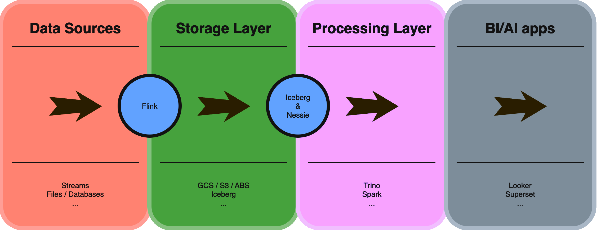

In an increasingly data-centric landscape, having a unified data architecture is critical for modern data platforms. We see increasing demand for a flexible, scalable, and cost-effective solution to manage and analyze large volumes of diverse data.

But not all architectures were designed to handle this. Traditional data lakes and warehouses often fall short in providing a seamless, efficient solution that can scale and adapt to the needs of businesses, especially in today's challenging economy. 

How do you bridge the gap between them, and evolve your architecture into something more dynamic and future proof ?

**Introducing -- The Data Lakehouse Architecture**

## Data Lakehouse

### What is a Data Lakehouse ?

A data lakehouse is a modern data architecture that creates a single platform by combining the key benefits of data lakes (large repositories of raw data in its original form) and data warehouses (organized sets of structured data). Specifically, data lakehouses enable organizations to use low-cost storage to store large amounts of raw data while providing structure and data management functions. 



### What features define a Data Lakehouse ?

The key data lakehouse features include:

- **Single data low-cost data store** for all data types (structured, unstructured, and semi-structured)
- **Data management features** to apply schema, enforce data governance, and provide ETL processes and data cleansing
- **Transaction support** for ACID (atomicity, consistency, isolation, and durability) properties to ensure data consistency when multiple users concurrently read and write data
- **Standardized storage formats** that can be used in multiple software programs
- **End-to-end streaming** to support real-time ingestion of data and insight generation
- **Separate compute and storage resources** to ensure scalability for a diverse set of workloads
- **Direct access for BI apps** to the source data in the lakehouse to reduce data duplication.

### Why adopt the Lakehouse architecture ?

The trend towards Lakehouse architectures in data management is driven by several key factors:

- **Data variety**: Companies now deal with structured, semi-structured, and unstructured data. Lakehouses can handle all these data types efficiently.
- **Cost-effectiveness**: Lakehouses combine the low-cost storage of data lakes with the powerful querying capabilities of data warehouses, offering a more economical solution.
- **Data silos elimination**: Lakehouses help break down data silos by providing a unified platform for all data types and analytics workloads.
- **Real-time analytics**: Lakehouse architectures support both batch and real-time data processing, enabling faster insights.
- **Machine learning integration**: Lakehouses provide strong support for machine learning workflows, allowing data scientists to work directly with raw data.
- **Data governance**: Lakehouses offer improved data governance and security features compared to traditional data lakes.
- **Scalability**: Lakehouse architectures can scale easily to accommodate growing data volumes and diverse analytical needs.
- **Flexibility**: They allow companies to use a variety of tools and technologies for data processing and analysis.

If you feel a bit overwhelmed at this point, don’t worry, getting started is a lot easier than you might think ✅

## Tech Stack

Let's introduce the stars of our show: **Flink, Iceberg & Nessie**

###  Flink

> **Stateful Computations over Data Streams**
> 
> 
> Apache Flink is a framework and distributed processing engine for stateful computations over unbounded and bounded data streams. Flink has been designed to run in all common cluster environments, perform computations at in-memory speed and at any scale.
> 
> Source: https://flink.apache.org/
> 

What you need to know:

- Flink is incredibly easy to get started with it. Deploying, managing and scaling your own Flink deployments through it’s k8s operator is a breeze.
- Flink by design is easy to extend, it feels a lot like Kafka Connect for example. Writing new formats or connectors is a well documented process. Nowadays, Flink can support pretty much any source, sink or format you might need.
- Flink allows you to turn pretty much any source of data into a stream. Transformating a batch job picking up files from an S3 or GCS buckets into a streaming query that will monitor said bucket for changes can be as simple as adding one argument to your table (ex: `source.monitor-interval`).
- Flink integrates nicely with most Data Catalogs, an essential piece in building our modern data lakehouse architecture.

###  Iceberg

> Iceberg is a high-performance format for huge analytic tables. Iceberg brings the reliability and simplicity of SQL tables to big data, while making it possible for engines like Spark, Trino, Flink, Presto, Hive and Impala to safely work with the same tables, at the same time.
> 
> Source: https://iceberg.apache.org/

I think this one is pretty self explanatory, in order to build our Data Lakehouse, we need a format that makes it possible to implement its properties, remember ACID transactions, Data management features (Schemas, Compaction …)

Here are the main features of Iceberg:

- Expressive SQL: Iceberg supports flexible SQL commands to merge new data, update existing rows, and perform targeted deletes. Iceberg can eagerly rewrite data files for read performance, or it can use delete deltas for faster updates.
- Schema Evolution: Schema evolution just works. Adding a column won't bring back "zombie" data. Columns can be renamed and reordered. Best of all, schema changes never require rewriting your table.
- Partition management: Iceberg handles the tedious and error-prone task of producing partition values for rows in a table and skips unnecessary partitions and files automatically. No extra filters are needed for fast queries, and table layout can be updated as data or queries change.
- Time Travel and Rollback: Time-travel enables reproducible queries that use exactly the same table snapshot, or lets users easily examine changes. Version rollback allows users to quickly correct problems by resetting tables to a good state.
- Data Compaction: Data compaction is supported out-of-the-box and you can choose from different rewrite strategies such as bin-packing or sorting to optimize file layout and size.


###  Nessie

> Nessie is an OSS service and libraries that enable you to maintain multiple versions of your data and leverage Git-like Branches & Tags for your Data Lake. Nessie enhances the Apache Iceberg table format with version control techniques!
> 

In order to start building our Data Lakehouse using Iceberg, we need a Data Catalog to help us keep track of our Iceberg Tables, their versions …

Nessie is heavily inspired by Git. The main concepts Nessie exposes map directly to [Git concepts](https://git-scm.com/book/en/v2). In most cases, you simply need to replace references of files and directories in Git with Tables in Nessie. The primary concepts in Nessie are:

- Commit: Consistent snapshot of all tables at a particular point in time.
- Branch: Human-friendly reference that a user can add commits to.
- Tag: Human-friendly reference that points to a particular commit.
- Hash: Hexadecimal string representation of a particular commit.

I’m sure most of you are familiar with Git, and you know it is today the de-facto standard for version control. Having similar features on top of our Data lakehouse is incredibly powerful.

## Deployment

**Pre-requisites:** 
* Kubernetes Cluster [(ex: Minikube)](https://minikube.sigs.k8s.io/docs/start/?arch=%2Fmacos%2Fx86-64%2Fstable%2Fbinary+download)
* Helm
* GCS bucket & GCP SA credentials
  * As I struggled a bit to find a simple guide showing how to integrate Flink, Nessie & GCS, I felt like it would be valuable to show how to do so here

Now let’s get started:

```bash
kubectl create ns flink-lakehouse && kubectl config set-context --current --namespace=flink-lakehouse
```

### Nessie

#### Setup

```bash
helm repo add nessie-helm https://charts.projectnessie.org
helm repo update
```

#### Deployment

```bash
helm install nessie -n flink-lakehouse helm/nessie
```


### Flink

#### Operator Installation

```jsx
helm repo add flink-operator-repo https://downloads.apache.org/flink/flink-kubernetes-operator-<OPERATOR-VERSION>/
helm install flink-kubernetes-operator flink-operator-repo/flink-kubernetes-operator
```

#### Docker image

As I said earlier Flink is designed to be extended, and this is done by making the required JAR available to Flink.

Steps:

<details>
  <summary>JARs</summary>

```bash
mkdir jars
```

>  Now download and add the following JARs to our folder:
>  - [flink-sql-parquet-1.17.2.jar](https://mvnrepository.com/artifact/org.apache.flink/flink-sql-parquet/1.17.2) (We will be querying raw parquet files for our example)
>  - [iceberg-gcp-bundle-1.5.2.jar](https://mvnrepository.com/artifact/org.apache.iceberg/iceberg-gcp-bundle/1.5.2) (Iceberg + GCS)
>  - [iceberg-flink-runtime-1.17-1.5.2.jar](https://repo.maven.apache.org/maven2/org/apache/iceberg/iceberg-flink-runtime-1.17/1.5.2/) (Iceberg + Flink)
</details>

    
<details>
  <summary>flink-hadoop-entrypoint.sh</summary>

  This make sure our hadoop classpath is well defined: `flink-hadoop-entrypoint.sh`
  
  ```bash
  #!/usr/bin/env bash
  
  # Note: hadoop_home is set in docker image
  export HADOOP_CLASSPATH="$(hadoop classpath)"
  
  /docker-entrypoint.sh
  ```
</details>

<details>
  <summary>Dockerfile</summary>

```docker
# Scala is needed for iceberg runtime
FROM flink:1.17.2-scala_2.12-java11

# <<<<<<<<<<<<<<<<<<<<<<>>>>>>>>>>>>>>>>>>>>>>>>>>>>
# <<<<<<<<<<<<<<<<<< HADOOP >>>>>>>>>>>>>>>>>>>>>>>>
# <<<<<<<<<<<<<<<<<<<<<<>>>>>>>>>>>>>>>>>>>>>>>>>>>>
ARG hadoop_version="3.3.5"
ARG hadoop_arch=""

ENV HADOOP_HOME /opt/hadoop/hadoop-$hadoop_version
WORKDIR /opt/hadoop

# Install hadoop
# See https://hadoop.apache.org/releases.html
RUN \
  # download the release hadoop-X.Y.Z-src.tar.gz from a mirror site.
  wget https://dlcdn.apache.org/hadoop/common/hadoop-$hadoop_version/hadoop-$hadoop_version$hadoop_arch.tar.gz && \
\
  # download the signature file hadoop-X.Y.Z-src.tar.gz.asc from Apache.
  wget https://downloads.apache.org/hadoop/common/hadoop-$hadoop_version/hadoop-$hadoop_version$hadoop_arch.tar.gz.asc && \
\
  # download the Hadoop KEYS file.
  wget https://downloads.apache.org/hadoop/common/KEYS && \
\
  # verify the download
  gpg --import ./KEYS && \
  gpg --verify hadoop-$hadoop_version$hadoop_arch.tar.gz.asc hadoop-$hadoop_version$hadoop_arch.tar.gz && \
\
  # Unarchive
  tar -xzf hadoop-$hadoop_version$hadoop_arch.tar.gz && \
\
  # Cleanup
  rm hadoop-$hadoop_version$hadoop_arch.tar.gz && \
  rm hadoop-$hadoop_version$hadoop_arch.tar.gz.asc && \
  rm KEYS
  
# Set JAVA_HOME in hadoop-env.sh, update path, etc.
RUN \
  echo "export JAVA_HOME=$JAVA_HOME" >> $HADOOP_HOME/etc/hadoop/hadoop-env.sh && \
  echo "PATH=$PATH:$HADOOP_HOME/bin" >> ~/.bashrc
ENV PATH=$HADOOP_HOME/bin:$PATH
ENV HADOOP_CONF_DIR $HADOOP_HOME/etc/hadoop
# <<<<<<<<<<<<<<<<<<<<<<>>>>>>>>>>>>>>>>>>>>>>>>>>>>
# <<<<<<<<<<<<<<<<<< HADOOP >>>>>>>>>>>>>>>>>>>>>>>>
# <<<<<<<<<<<<<<<<<<<<<<>>>>>>>>>>>>>>>>>>>>>>>>>>>>

WORKDIR $FLINK_HOME

# Google Cloud Storage plugin
RUN mkdir /opt/flink/plugins/gs-fs-hadoop && cp /opt/flink/opt/flink-gs-fs-hadoop-*.jar /opt/flink/plugins/gs-fs-hadoop/

# Copy jars in this github repo to the flink lib directory
# * Flink SQL Parquet
# * Flink iceberg runtime
COPY ./jars/ /opt/flink/lib/

COPY ./entrypoint/flink-hadoop-entrypoint.sh /flink-hadoop-entrypoint.sh
ENTRYPOINT ["/flink-hadoop-entrypoint.sh"]
```
</details>

#### Deploy our Flink cluster

<details>
  <summary> gcp-credentials.yaml </summary>

```yaml
apiVersion: v1
kind: Secret
metadata:
  name: gcp-creds
data:
  gcp-creds: "${b64encode(GCP_SA_JSON_KEY})}" # Replace this
```
</details>    
<details>
  <summary> catalog.yaml </summary>

  ```yaml
  apiVersion: v1
  kind: ConfigMap
  metadata:
    name: flink-catalogs
  data:
    # Don't forget to replace with your GCS bucket path
    nessie.yaml: |
      ref: "main"
      type: "iceberg"
      warehouse: "gs://${YOUR_GCS_BUCKET}/"
      catalog-impl: "org.apache.iceberg.nessie.NessieCatalog"
      uri: "http://nessie.nessie-ns:19120/api/v1"
      io-impl: "org.apache.iceberg.gcp.gcs.GCSFileIO"
  ```
</details>    
<details>
  <summary> flink-deployment.yaml </summary>

```yaml
apiVersion: flink.apache.org/v1beta1
kind: FlinkDeployment
metadata:
  name: dsp-flink
spec:
  image: ${OUR_FLINK_DOCKER_IMAGE}
  flinkVersion: v1_17
  mode: standalone
  flinkConfiguration:
    taskmanager.numberOfTaskSlots: "1"
    table.catalog-store.kind: file
    table.catalog-store.file.path: ./catalogs
  serviceAccount: flink
  jobManager:
    resource:
      memory: "1024m"
      cpu: 1
    podTemplate:
      spec:
        containers:
        - name: flink-main-container
          env:
          - name: GOOGLE_APPLICATION_CREDENTIALS
            value: /opt/flink/secrets/gcp-creds
          volumeMounts:
            - mountPath: /opt/flink/secrets
              name: gcp-creds
            - mountPath: /opt/flink/catalogs
              name: catalogs
        volumes:
        - name: gcp-creds
          secret:
            secretName: gcp-creds
        - name: catalogs
          configMap:
            name: flink-catalogs
  taskManager:
    resource:
      memory: "1024m"
      cpu: 1
    podTemplate:
      spec:
        containers:
        - name: flink-main-container
          env:
          - name: GOOGLE_APPLICATION_CREDENTIALS
            value: /opt/flink/secrets/gcp-creds
          volumeMounts:
            - mountPath: /opt/flink/secrets
              name: gcp-creds
            - mountPath: /opt/flink/catalogs
              name: catalogs
        volumes:
        - name: gcp-creds
          secret:
            secretName: gcp-creds
        - name: catalogs
          configMap:
            name: flink-catalogs
```
</details>

## Flink Table API & SQL

Apache Flink features two relational APIs - the Table API and SQL. 

The Table API is a language-integrated query API for Java, Scala, and Python that allows the composition of queries from relational operators such as selection, filter, and join in a very intuitive way. 

Flink’s SQL support is based on [Apache Calcite](https://calcite.apache.org/) which implements the SQL standard. Queries specified in either interface have the same semantics and specify the same result regardless of whether the input is continuous (streaming) or bounded (batch).

Let’s try this out, first we need some data:

### Dataset

Let’s use [New York’s taxi trip data](https://www.nyc.gov/site/tlc/about/tlc-trip-record-data.page)

Download one of those files and add it to your GCS bucket in a `nyc/` folder.

### Let’s query our Source dataset

**1. Flink SQL client**

```bash
kubectl exec -it deployment/dsp-flink ./bin/sql-client.sh
```

**2. Let’s configure our SQL environment:**

```sql
SET 'sql-client.execution.result-mode' = 'tableau';
```

**3. Let’s create a new table:**

```sql
CREATE TABLE TaxiTrips (
    VendorID INT,
    tpep_pickup_datetime BIGINT,
    tpep_dropoff_datetime BIGINT,
    passenger_count BIGINT,
    trip_distance DOUBLE,
    RatecodeID BIGINT,
    store_and_fwd_flag STRING,
    PULocationID INT,
    DOLocationID INT,
    payment_type BIGINT,
    fare_amount DOUBLE,
    extra DOUBLE,
    mta_tax DOUBLE,
    tip_amount DOUBLE,
    tolls_amount DOUBLE,
    improvement_surcharge DOUBLE,
    total_amount DOUBLE,
    congestion_surcharge DOUBLE,
    Airport_fee DOUBLE
) WITH (
  'connector' = 'filesystem',
  'path' = 'gs://${YOUR_GCS_BUCKET}/nyc/',
  'format' = 'parquet',
  'source.monitor-interval' = '1m'
);
```

> This configuration setting `'source.monitor-interval' = '1m'` tells Flink to periodically check the specified source location (in this case, the GCS bucket) for new or modified files. The '1m' value means it will perform this check every 1 minute.

**4. Validate it works**

```sql
SELECT * FROM NycDataset;
```

### Iceberg table

Now let’s convert our NycDataset in the desired Lakehouse format:

**1. Use our Iceberg Catalog: Nessie**

Remember, we defined this catalog as part of our Flink deployment

```sql
USE CATALOG nessie;
CREATE database nycdataset;
```

**2. Create our Iceberg Table**

```sql
CREATE TABLE nycdataset.TaxiTrips (
   VendorID INT,
   tpep_pickup_datetime BIGINT,
   tpep_dropoff_datetime BIGINT,
   passenger_count BIGINT,
   trip_distance DOUBLE,
   RatecodeID BIGINT,
   store_and_fwd_flag STRING,
   PULocationID INT,
   DOLocationID INT,
   payment_type BIGINT,
   fare_amount DOUBLE,
   extra DOUBLE,
   mta_tax DOUBLE,
   tip_amount DOUBLE,
   tolls_amount DOUBLE,
   improvement_surcharge DOUBLE,
   total_amount DOUBLE,
   congestion_surcharge DOUBLE,
   Airport_fee DOUBLE
);
```

**3. Move our data**

```sql
INSERT INTO nycdataset.TaxiTrips
SELECT *
FROM default_catalog.default_database.TaxiTrips;
```

**4. Query our Data Lakehouse**

```sql
SET 'sql-client.execution.result-mode' = 'tableau';
SET 'execution.runtime-mode' = 'batch';

select * FROM nessie.nycdataset.TaxiTrips LIMIT 10;
select count(*) FROM nessie.nycdataset.TaxiTrips;
```

> This fact that our source table is unbouded effectively creates a pipeline that keeps your Iceberg table up-to-date with the latest data from your raw files, enabling near real-time data availability in your Data Lakehouse. It's a powerful feature that bridges the gap between batch and stream processing, allowing for fresher data in your analytics and downstream applications.

## Conclusion

With Apache Flink's powerful connector capabilities, Apache Iceberg's high-performance table format, and Nessie's version control features, we've created a robust foundation for a Data Lakehouse.
The lakehouse architecture combines the best of data lakes and data warehouses, offering a flexible, scalable, and cost-effective solution for managing and analyzing large volumes of diverse data.

With a few minutes, we've layed foundation do an architecture that will scale as data volumes continue to grow and analytical needs become more complex.


## Coming Next

- Proto Confluent format for Flink
- BigQuery "CDC" with Flink
- Flink HTTP Source connector
